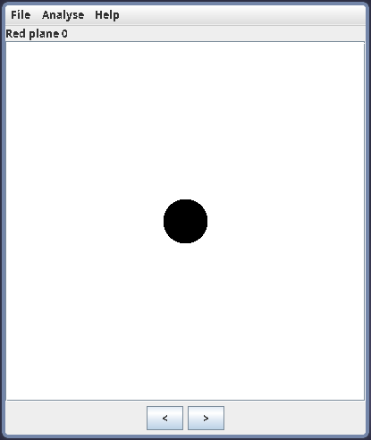
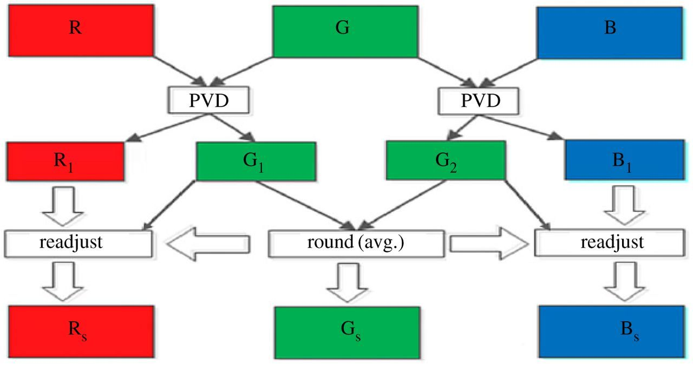
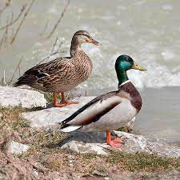

# Pixel Value Differencing (PVD) Steganography Presentation

## Least significant bit (LSB) steganography
Lab05 was based on LSB:

Set number of bits encoded in the smallest bits of a pixel or color channel.

In the lab, encoded smallest 2 bits of green value in pixels where red and blue values both had last 3 bits as `000`

However there are problems when only LSB is used
  - Inefficient in space, as it requires 4 pixels to encode a single byte
  - Can be trivially easy to detect, especially with tools such as stegsolve.

newmodifiedCat from website |  Area found by stegsolve
:-------------------------:|:-------------------------:
  |    

## PVD steganography
Instead of just changing the pixel values directly, we take the difference of two values and encode data into that instead.

For this example we used grayscale images, as each pixel is only one byte in value (RGB values are the same)

If we want to hide a message, we have to go through every two pixels inside a image.
1. Take the difference of the two pixels
2. Encode bits of the message into the difference (If none are left, encode zeroes)
3. Adjust the new pixel values using the new difference

This graph encodes bits 001 into two pixels
@ | 1st Value | 2nd Value | Difference
:--:|:--:|:--:|:--:
Before | 120 | 150 | 30 (11110) 
After  | 122 | 153 | 25 (11001)

### Encoding more bits
Two bits per block is too little, we can cram more bits without affecting the color too much.

Depending on how big the difference is, we can encode more bits into the difference.
- "Smooth" areas with little differences between values are easier to detect with the naked eye, and so are encoded with less data
- "Rough" areas with greater differences between values are harder to detect with the naked eye, and so are encoded with more data
- This allows more data to be encoded without raising suspicion

The amount of bits per difference is based on its range (lower,upper).
Index | Lower | Upper | Bits | Binary
:--:|:--:|:--:|:--:|:--:
0 | 0 | 7 | 3 | 00000xxx
1 | 8 | 15 | 3 | 00001xxx
2 | 16 | 31 | 4 | 0001xxxx
3 | 32 | 63 | 5 | 001xxxxx
4 | 64 | 127 | 6 | 01xxxxxx
5 | 128 | 255 | 7 | 1xxxxxxx

Using previous example, the difference of 30 is between 16-31, so we can encode 4 bits (0010).
@ | 1st Value | 2nd Value | Difference
:--:|:--:|:--:|:--:
Before | 120 | 150 | 30 (11110) 
After  | 126 | 158 | 18 (10010)

Before | After
:--:|:--:
 | 
 | 

### Overflow and underflow
Some values may be too close to 0 or 255 but have large differences to each other. This can cause values to overflow or underflow.

1st Value | 2nd Value | Diff
:--:|:--:|:--:
22 | 250 | 228

If we encoded with bits of one to get the maximum possible difference of 255, this would result:

1st Value | 2nd Value | Diff
:--:|:--:|:--:
10 | 263 | 255

Obviously a value of 263 is not possible, and will cause it to overflow, which can result in a different difference and color.

To keep colors consistent, we decided to skip to the next two pixels if any of the values have a possibility of going outside the number range 0-255.

### What about color images?
Color images are more flexible for how to encode images onto them, as there are three values on each pixel (alpha is useless to us)

One method of encoding is the exact same as the grayscale method, but encode only one color (either red, green, or blue)
* This is lazy and doesn't make use of the other two bytes of data we can use to encode.

Another method is going through each pixel and using PVD on two colors of a pixel (red-green, red-blue, etc..)
* Better but there is still one byte of data that is left out. 

The third method uses all 3 colors in one pixel to encode data, which is the one we are going to use.

In this method, since we have only 3 colors, we have to use overlapping blocks, which means using PVD twice with only three colors.

For every pixel:
1. Find the difference of red and green, then encode data onto it.
2. Calculate the new red* and green value from the new difference.
3. Find the difference of green and blue, then encode data.
4. Calculate the new green and blue* value from the new difference.

The red and blue values we calculated so far can only be used if encoding one of the colors causes an over/underflow.
* For example, if we have color(50,210,250), the max difference of green-blue can overflow on green, so it is skipped.
* Instead we only encode the values of red-green for this pixel.

However most of the pixels will have both differences with encoded data, so we need to find new red, green, and blue values to fit the differences.

* We did this by calculating the average of the two green values to get our new green value.
* Subtract the new green value with the red-green difference for the new red value.
* Subtract the new green value with the green-blue difference for the new blue value.

Overlapping blocks allows for maintained information density and efficiency with encoding. Also, color images are less conspicuous than grayscale images when being sent, so the purpose of steganography is still fulfilled

Ducks |  Ducks with PVD encoding
:-------------------------:|:-------------------------:
  |    

### Decoding

Decoding images with PVD is pretty easy when you know the algorithim.

For grayscale images:
1. Take the difference of two pixels
2. Check if the value can cause overflow/underflow as described before.
3. Find the amount of bits encoded into difference, then store the bits.
   * We decided to store every 8 bits into a char value, then appending it into a string.
4. Continue to next 2 pixels until there are no more pixels.
   * Since we know we are decoding text, we can safely exit if the last eight bits are all zeroes, as it denotes a null character (end of string).

For colored images, we use the same process except we go through every pixel instead. Remember to start with red+green first before green+blue.

## Homework

Will be provided on the Cybersecurity Group Sheet page.
